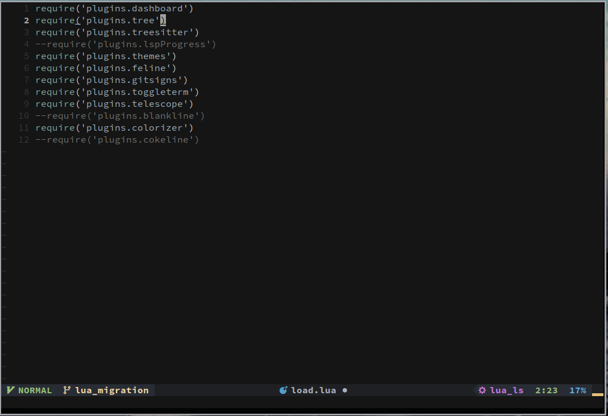

# Ashirak Neovim

 

> Descrição

    Distro neovim pessoal feita para desenvolvimento web e edição de pequenos
    scripts, com o maximo de minimalismo e leveza que pude extrair.
    
    Consumo:
    520mb RAM
    2Core CPU

 

>Dependência  
 - git 
 - npm 
 - Packer

> Funcionalidades
 
 
 
 -  LSP [ PHP, JavaScript, TypeScript, CSS, HTML ]
 -  Syntax [ PHP, JavaScript, TypeScript, CSS, HTML, Markdown ]
 -  Css colors
 -  Terminal toggle 
 -  Git diff maker 
 -  Code stats
 -  Telescope
 -  Dashboard
 -  BlankLines
 -  NeoTree
 
 > Shortcuts

 

| Comando | Keys|
 ----------|------
 | Toggle Term | Ctrl-t|
 | Terminal unfocused| Esc| 
 | Select autocomplete | Return |
 | Clouse buffer | F4 or q|
 | MultiLines | Crtl-n|
 | Dashboard| D|
 | Dashboard Update Plugins | u |
 | NerdTreeToggle | Space-e|
 | Next buffer| Crtl-d|
 | Previous buffer | Crtl-a| 
 | Save File| Crtl-s|
 | Go Definition | gd|
 | Go Implementation | gi|
 | Go references | gr |
 | Telescope Find Files | tf |
 | Telescope Live Grep | tg |
 | Telescope Buffers | tb |
 | Telescope Help Tags | fh |
 
  
 
 > Plugins 
 
 - LspZero
 - NeoTree
 - WakaTime
 - vimCssColor
 - GitSigns
 - Furgitive
 - Feline
 - ToggleTerminal
 - Treesitter
 - Telescope 

  
 
 > Temas
 
  - [colorscheme] no-clown-fiesta
  - [airline] one-monokai 
